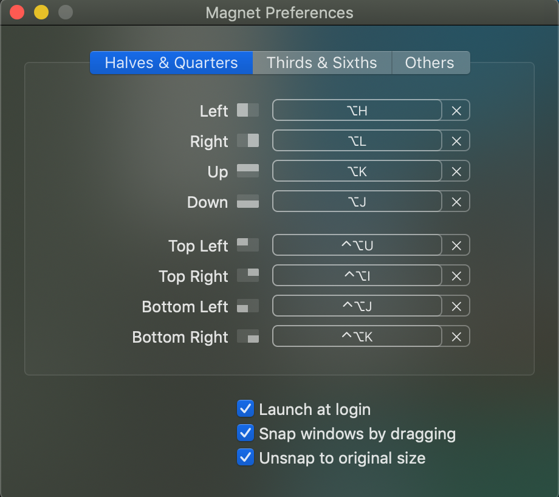
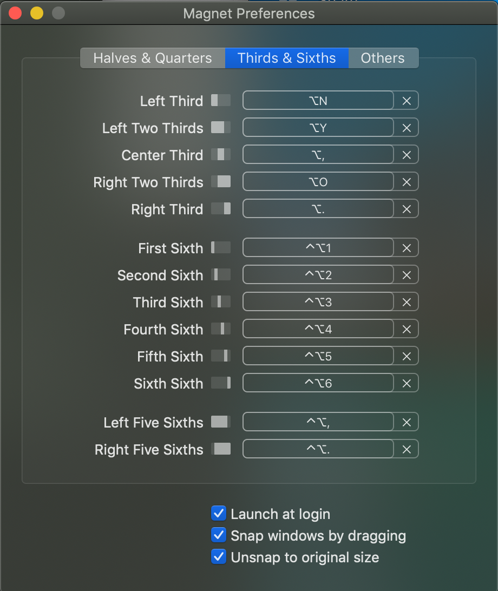
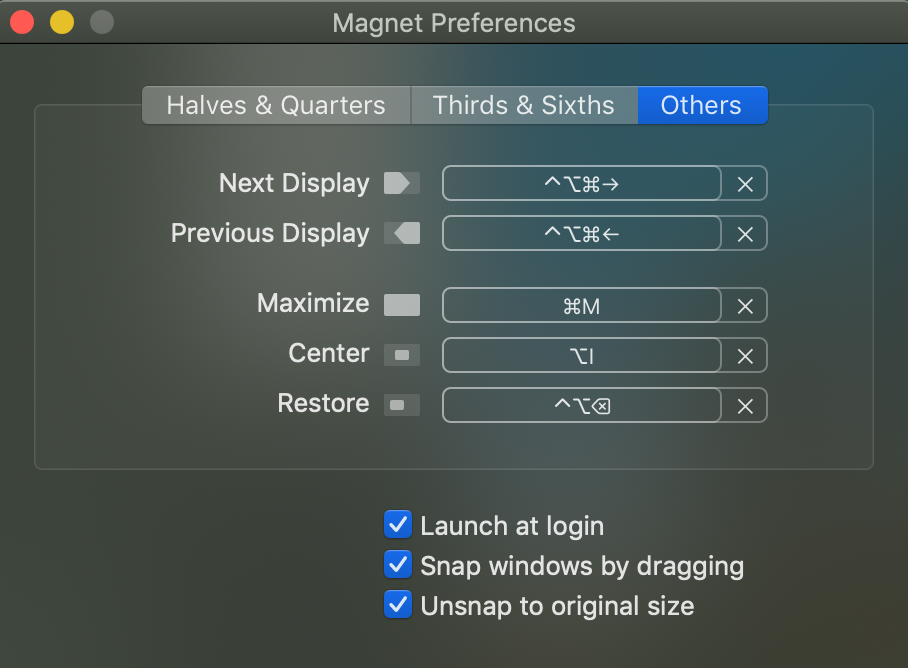
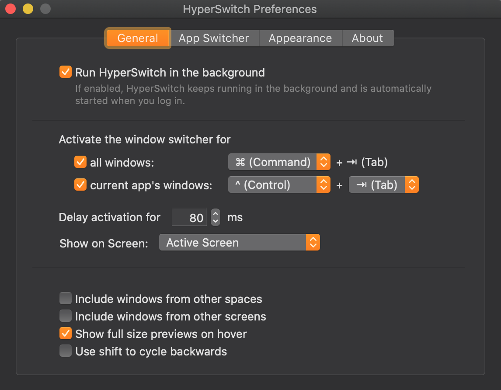

# Dev Setup

1. Install xcode run `xcode-select --install`
2. Download [1Password](https://1password.com/downloads/mac/) and setup another device on existing computer
3. ~~[Create a Rosetta version of terminal](https://osxdaily.com/2020/11/18/how-run-homebrew-x86-terminal-apple-silicon-mac/)~~
4. Clone dotfiles in home directory `git clone https://github.com/jsfeb26/dotfiles.git`
5. Sign into App Store
6. Run `bash ~/dotfiles/osx-install.sh`
7. Run `bash ~/dotfiiles/post-install.sh`
8. If you get `Zsh detects insecure completion-dependent directories` errors then run:

```bash
chmod 755 /usr/local/share/zsh
chmod 755 /usr/local/share/zsh/site-functions
```

## Customize Settings

---

### iCloud

- Sync Desktop and Documents

### Sign In To Accounts

- Dropbox
- Chrome
- Bear
- Things
- Kindle
- Evernote

### Magnet Settings





### Alfred Settings and Snippets

- Open Alfred and Skip Setup
- Open System Preferences -> Keyboard -> Shortcuts -> Spotlight
  - Unheck both checkboxes
- Go back to Alfred and set hotkey to cmd+space
- Click on Powerpack and then "Activate License"
  - Find license key in email
- Go to Advanced and under Syncing click 'Set prefences folder..."
  - Choose `~/Dropbox/Alfred/`
- Go to Features -> Clipboard and check all of the clipboard history options

### Mac Settings

- Install Flipqlo Clock Screen Saver `~/dotfiles/installers/Fliqlo.dmg`
- Install TrackballWorks `~/dotfiles/installers/TrackballWorks.dmg`
  
- [Install Logitech Options](https://support.logi.com/hc/en-us/articles/360025297893)
  - Installer is located in Dropbox/Installers
  - Make bottom button open Mission Control
- Keyboard Settings
  
  
  
- Mouse Settings
  
- Energy Saver
  
- Hot Corners
  
- Mission Control
  
- General
  
- Dock
  
- [Optional] set key repeat `defaults write NSGlobalDomain ApplePressAndHoldEnabled -bool false`

### iTerm2 Sync Settings

- Preferences -> General -> Preferences
- Check both checkboxes and set path to `/Users/{username}/dotfiles/profiles/iterm`

### hyperswitch



### Iris

- Buy new license or transfer license by signing in to [User Panel](https://iristech.co/custom-code/user-panel/pages/my_licenses.php)
  - 1.1.5 Macbook Air 2021
  - 1.2.0 Macbook Pro (Ambient)
- Use installer for in specific iris version in `/installers/*`
  
  
  
  
  
- ~~Go to Advanced -> Hidden Features~~
- ~~Type in `import` and choose `/Users/{username}/dotfiles/profiles/iris.iris_settings`~~

### VSCode

- Click Settings Icon in bottom left and turn `Settings Sync`
- Check all checkboxes and sign in with GitHub
- ~~Install "Settings Sync" in VSCode~~
- ~~In 1Password go to Github and copy token `vs-code-setting-sync-token` and gistID `vscode-sync-gist`~~
- ~~In VSCode open command palette (`command + shift + p`) and then type `Sync: Download Settings`~~
- ~~Enter token and gistId~~
- ~~Restart VSCode~~

### Github add SSH Key

- Go to [Github keys settings](https://github.com/settings/keys)
- Click "New SSH Key"
- Run `ssh-keygen -t rsa -b 4096 -C "jsfeb26@gmail.com"`
- Follow default prompts
- Run `eval "$(ssh-agent -s)"`
- Run `open ~/.ssh/config` to see if config file exists. It shouldn't
- Run `touch ~/.ssh/config` and then `code ~/.ssh/config`
- Paste in

```config
Host *
  AddKeysToAgent yes
  UseKeychain yes
  IdentityFile ~/.ssh/id_rsa
```

- Run `ssh-add -K ~/.ssh/id_rsa` to asdd your SSH private key to the ssh-agent and store your passphrase in the keychain
- Get SSH Key by running `pbcopy < ~/.ssh/id_rsa.pub`
- Paste in Github SSH Key field

### Vim

- Open vim and run `:PlugInstall`

### Brave

- Import from Chrome

### Home Inventory

- Open `iCloud Drive/Home Inventory/My_Stuff.hi3`
- Update Backup Settings
  
- Run by double clicking `~/dotfiles/installers/Send-to-Home-Inventory.workflow`
- Run `git co settings`

### Install Hot

- <https://github.com/macmade/Hot/releases>
- Check top 3 checkboxes and "Start at Login"
- Change Font to "Dank Mono"

### Install CleanShotX

- [Download](https://licenses.cleanshot.com/download/cleanshotx) or use installer in repo
- Get License Key from 1Password
- TODO: Share settings here once it's configured

### Install Bartender 4

- [Download](https://www.macbartender.com/Bartender4/purchase.html) or use installer in repo
- Get License Key from 1Password
- TODO: Share settings here once it's configured
