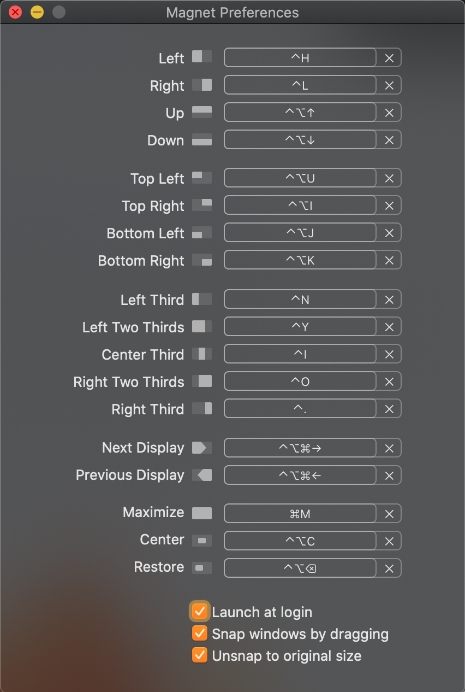

# Dev Setup

1. Download [zip](https://github.com/jsfeb26/dotfiles) and put in `~/dotfiles`
2. Run `~/dotfiles/osx-install.sh`

## Customize Settings

1. iCloud
   - Sync Desktop and Documents
2. 1password
   - Open 1password and Sign into account
3. Dropbox
   - Sign In
4. Magnet Settings
   
5. Alfred Settings and Snippets
6. iTerm2 Sync Settings
   - Preferences -> General -> Preferences
   - Check both checkboxes and set path to `/Users/{username}/dotfiles/profiles/iterm`
7. hyperswitch
   
8. Brave
   - Import from Chrome
9. Chrome
   - Sign In
10. Iris
    - Go to Advanced -> Hidden Features
    - Type in `import` and choose `/Users/{username}/dotfiles/profiles/iris.iris_settings`
11. Kindle
    - Sign In
12. Evernote
    - Sign In
13. VSCode
    - Install "Settings Sync" in VSCode
    - In 1Password go to Github and copy token `vs-code-setting-sync-token` and gistID `vscode-sync-gist`
    - In VSCode open command palette (`command + shift + p`) and then type `Sync: Download Settings`
    - Enter token and gistId
    - Restart VSCode
14. Atom
15. Bear
    - Sign In
16. Todoist
    - Sign In
17. Home Inventory
    - Open `iCloud Drive/Home Inventory/My_Stuff.hi3`
    - Update Backup Settings
      
18. Github
    - Add SSH Key
      - Go to [Github keys settings](https://github.com/settings/keys)
      - Click "New SSH Key"
      - Get SSH Key by running `pbcopy < ~/.ssh/id_rsa.pub`
